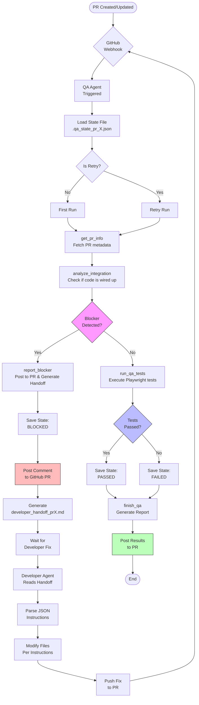
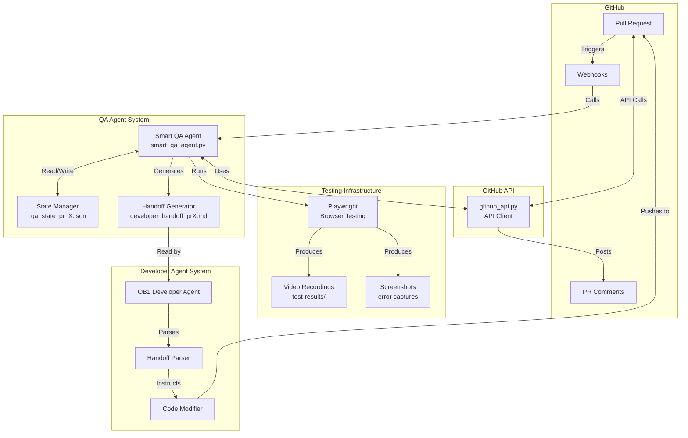
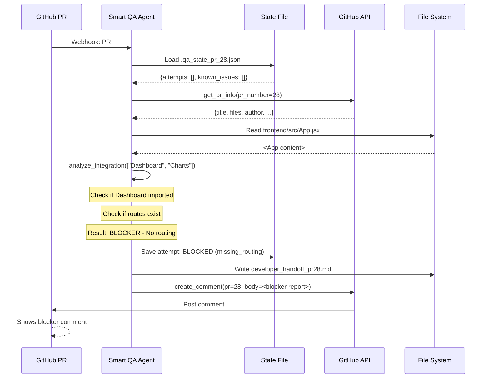
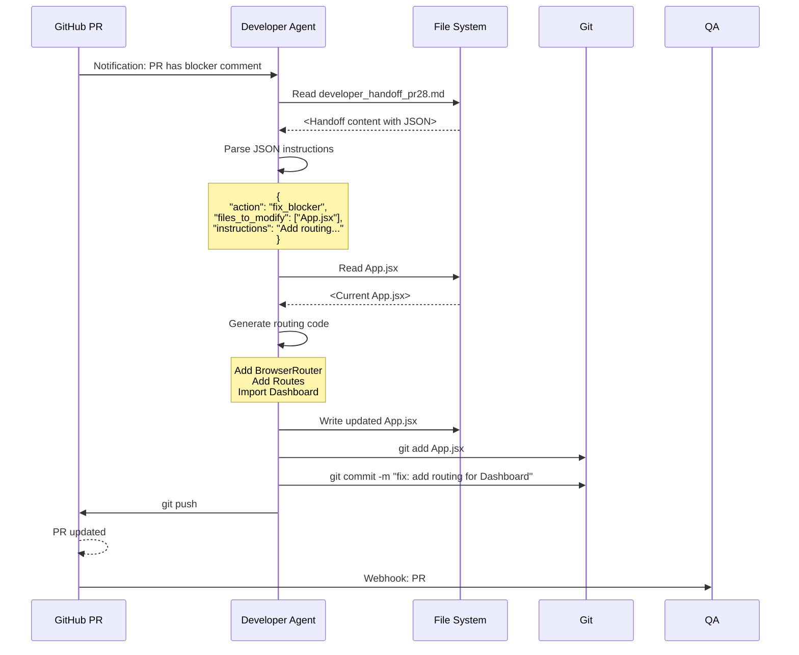
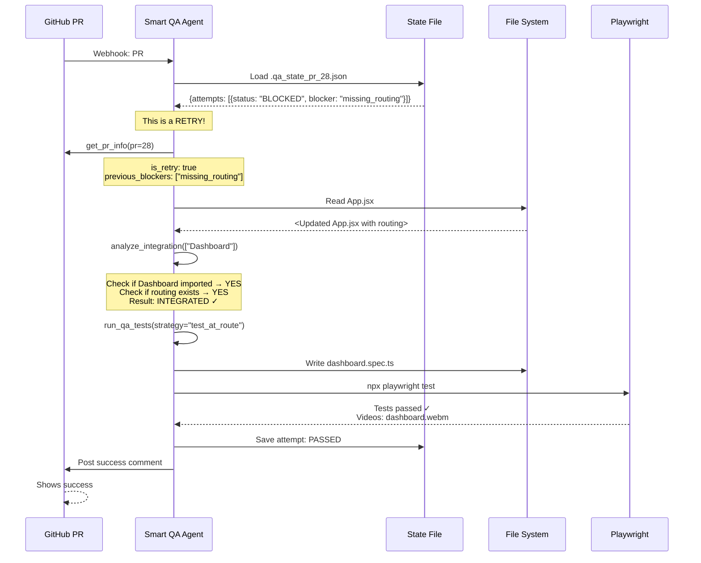
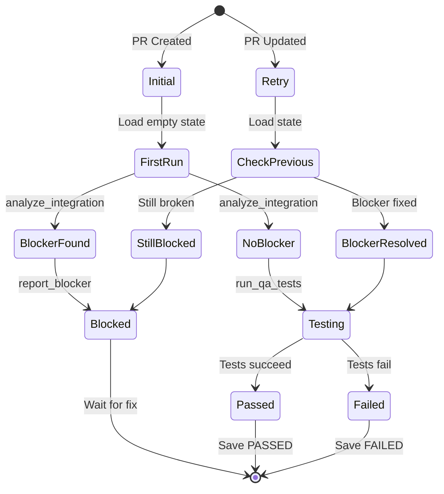
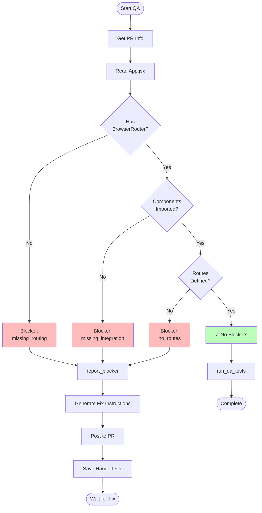

# OB1 Autonomous QA System - Complete Architecture

**Version:** 1.0
**Last Updated:** 2025-01-09
**Purpose:** Comprehensive documentation of the autonomous QA system for brainstorming and LLM analysis

---

## Table of Contents
1. [System Overview](#system-overview)
2. [High-Level Flow](#high-level-flow)
3. [Component Architecture](#component-architecture)
4. [Detailed Workflows](#detailed-workflows)
5. [Code Documentation](#code-documentation)
6. [State Management](#state-management)
7. [Error Handling](#error-handling)
8. [Integration Points](#integration-points)

---

## System Overview

### What This System Does

The OB1 Autonomous QA System is a **self-healing development loop** where:
- 🤖 **Developer agents** create PRs with new code
- 🔍 **QA agents** automatically test PRs
- 🚫 **Blockers** are detected and reported
- 🔧 **Developer agents** fix blockers
- ♻️ **Loop continues** until tests pass
- 💾 **Memory persists** across retries

### Key Principles

1. **Autonomous** - No human intervention required
2. **Smart** - Detects blockers before wasting resources
3. **Memoryful** - Remembers past failures
4. **Actionable** - Provides exact fix instructions
5. **Looped** - Dev agent ↔ QA agent communication

---

## High-Level Flow

### Complete PR Lifecycle



---

## Component Architecture

### System Components



---

## Detailed Workflows

### Workflow 1: First QA Run (Blocker Detected)



#### Code: analyze_integration

```python
# File: src/ob1/smart_qa_agent.py
# Function: SmartQAAgent._analyze_integration()

async def _analyze_integration(self, component_names: list[str]) -> dict[str, Any]:
    """
    Check if components are properly integrated into the app

    This is the KEY function that detects blockers BEFORE testing.

    Args:
        component_names: List of React component names to check
                        e.g., ["Dashboard", "Charts", "Sidebar"]

    Returns:
        dict with:
            - integrated: bool - Are components wired up?
            - has_router: bool - Is routing configured?
            - route_count: int - How many routes exist?
            - missing_imports: list - Which components not imported?
            - issues: list - Human-readable issues found
            - blocker_type: str - Type of blocker for reporting

    Example Flow:
        1. Read App.jsx content
        2. Check for "BrowserRouter" or "Routes" → has_router
        3. For each component, check if imported → missing_imports
        4. Count "<Route" occurrences → route_count
        5. Determine if it's a blocker
    """
    app_jsx = self.worktree_path / "frontend" / "src" / "App.jsx"

    if not app_jsx.exists():
        return {
            "integrated": False,
            "blocker": "App.jsx not found",
            "components_checked": component_names
        }

    # Read the App.jsx file
    app_content = app_jsx.read_text()

    # Initialize issues list
    issues = []

    # CHECK 1: Is routing configured?
    has_router = "BrowserRouter" in app_content or "Routes" in app_content
    if not has_router:
        issues.append("No routing configured (missing BrowserRouter/Routes)")

    # CHECK 2: Are components imported?
    missing_imports = []
    for component in component_names:
        if component not in app_content:
            missing_imports.append(component)

    if missing_imports:
        issues.append(f"Components not imported: {', '.join(missing_imports)}")

    # CHECK 3: Are routes defined?
    route_count = app_content.count("<Route")
    if route_count == 0 and missing_imports:
        issues.append("No routes defined for new components")

    # DECISION: Is it integrated?
    is_integrated = len(issues) == 0

    # Log to console
    self.console.print(f"[{'green' if is_integrated else 'yellow'}]   Integration: {'✓ OK' if is_integrated else '✗ Issues found'}[/{'green' if is_integrated else 'yellow'}]")
    if issues:
        for issue in issues:
            self.console.print(f"[dim]      - {issue}[/dim]")

    return {
        "integrated": is_integrated,
        "has_router": has_router,
        "route_count": route_count,
        "missing_imports": missing_imports,
        "issues": issues,
        "components_checked": component_names,
        "blocker_type": "missing_routing" if not has_router else "missing_integration"
    }
```

**Why This Matters:**
- This function prevents the QA agent from wasting time testing code that can't work
- It detects the **root cause** (missing routing) instead of just seeing test failures
- It provides **structured data** for generating fix instructions

---

### Workflow 2: Developer Fixes Blocker



#### Code: Developer Handoff Format

```python
# File: src/ob1/smart_qa_agent.py
# Function: SmartQAAgent._report_blocker()

async def _report_blocker(
    self,
    blocker_type: str,
    description: str,
    fix_instructions: str,
    files_to_modify: list[str]
) -> dict[str, Any]:
    """
    Report a blocker that prevents QA testing.

    This function:
    1. Generates a human-readable report
    2. Embeds machine-parseable JSON for dev agents
    3. Posts comment to GitHub PR
    4. Saves handoff file locally
    5. Updates state with blocker info

    Args:
        blocker_type: Category of blocker
                     e.g., "missing_routing", "build_error", "missing_deps"
        description: Human-readable explanation
        fix_instructions: Step-by-step fix guide
        files_to_modify: List of files that need changes

    Returns:
        dict with:
            - blocker_reported: bool
            - pr_commented: bool
            - handoff_file: str path to handoff file
            - dev_handoff: str full markdown content
    """

    # FORMAT THE DEVELOPER HANDOFF
    # This is CRITICAL - it's how the dev agent knows what to do
    dev_handoff = f"""## 🚫 QA Blocker Detected

**PR:** #{self.pr_number}
**Repository:** {self.repo_ref.owner}/{self.repo_ref.name}
**Blocker Type:** `{blocker_type}`

### Issue Description
{description}

### Files to Modify
{chr(10).join(f'- `{f}`' for f in files_to_modify) if files_to_modify else 'N/A'}

### Fix Instructions
{fix_instructions}

### For Developer Agent
```json
{{
  "action": "fix_blocker",
  "pr_number": {self.pr_number},
  "repository": "{self.repo_ref.owner}/{self.repo_ref.name}",
  "blocker_type": "{blocker_type}",
  "files_to_modify": {json.dumps(files_to_modify)},
  "instructions": "{fix_instructions.replace(chr(10), ' ')}"
}}
```

---
*🤖 Posted by Autonomous QA Agent*
"""

    # SAVE TO STATE
    # This is how we remember what went wrong
    self.state["known_issues"].append(blocker_type)
    self.state["attempts"].append({
        "timestamp": "now",  # Would use datetime.now() in production
        "status": "BLOCKED",
        "blocker": blocker_type
    })
    self._save_state()

    # POST COMMENT TO PR
    try:
        async with GitHubAPI(self.github_token) as gh:
            await gh.create_comment(self.repo_ref, self.pr_number, dev_handoff)
        self.console.print(f"[green]   ✓ Posted blocker comment to PR #{self.pr_number}[/green]")
    except Exception as e:
        self.console.print(f"[yellow]   ⚠ Could not post comment: {e}[/yellow]")

    # WRITE HANDOFF FILE
    # Developer agent reads this file
    handoff_file = Path(f"developer_handoff_pr{self.pr_number}.md")
    handoff_file.write_text(dev_handoff)
    self.console.print(f"[green]   ✓ Wrote developer handoff: {handoff_file}[/green]")

    return {
        "blocker_reported": True,
        "pr_commented": True,
        "handoff_file": str(handoff_file),
        "dev_handoff": dev_handoff
    }
```

**Key Features:**
1. **Dual Format**: Human markdown + Machine JSON
2. **Repo Context**: Always includes `repository` field so agent knows where to push
3. **Exact Files**: Lists specific files to modify
4. **Actionable**: Step-by-step instructions, not vague suggestions

---

### Workflow 3: Retry After Fix



#### Code: Smart Retry Logic

```python
# File: src/ob1/smart_qa_agent.py
# Function: SmartQAAgent._get_pr_info()

async def _get_pr_info(self) -> dict[str, Any]:
    """
    Get PR information and previous QA state.

    This function is SMART - it knows if this is a retry attempt
    and what blockers were found previously.

    Returns:
        dict with:
            - pr_number, title, author, repo: Basic PR info
            - changed_files: List of modified files
            - is_retry: bool - Is this a retry after a blocker?
            - previous_blockers: list - What was wrong before?
            - last_status: str - Last QA result (PASSED/FAILED/BLOCKED)

    Retry Logic:
        If is_retry = True, the agent will:
        1. Check if previous blockers are fixed
        2. Skip redundant checks
        3. Focus on what was broken before
    """
    # Fetch PR data from GitHub
    async with GitHubAPI(self.github_token) as gh:
        pr_data = await gh.get_pull_request(self.repo_ref, self.pr_number)
        files = await gh.list_pull_files(self.repo_ref, self.pr_number)

    # CHECK IF THIS IS A RETRY
    # If we have previous attempts, this is a retry
    is_retry = len(self.state["attempts"]) > 0
    previous_blockers = self.state.get("known_issues", [])

    # LOG TO CONSOLE
    self.console.print(f"[green]   ✓ PR #{self.pr_number}: {pr_data['title']}[/green]")
    if is_retry:
        self.console.print(f"[yellow]   ⚠ Retry attempt {len(self.state['attempts']) + 1}[/yellow]")
        self.console.print(f"[yellow]   Previous blockers: {', '.join(previous_blockers)}[/yellow]")

    return {
        "pr_number": self.pr_number,
        "title": pr_data["title"],
        "author": pr_data["user"]["login"],
        "repo": f"{self.repo_ref.owner}/{self.repo_ref.name}",
        "changed_files": [f["filename"] for f in files],
        "is_retry": is_retry,
        "previous_blockers": previous_blockers,
        "last_status": self.state.get("last_status")
    }
```

---

## Code Documentation

### File: `src/ob1/smart_qa_agent.py`

**Purpose:** Main QA agent with memory, blocker detection, and developer handoff

#### Class: `SmartQAAgent`

```python
class SmartQAAgent:
    """
    Smart QA agent with memory and blocker handling.

    This is the CORE of the autonomous QA system.

    Responsibilities:
    1. Detect integration blockers before testing
    2. Post structured issues to GitHub PRs
    3. Generate developer handoff files
    4. Remember previous failures
    5. Resume testing after fixes

    Architecture:
        - Uses Claude Haiku (cheap, fast) for tool execution
        - Tool-based agentic architecture (not hardcoded logic)
        - Stateful (saves to .qa_state_pr_X.json)
        - GitHub integration (posts comments)

    State Machine:
        INITIAL → get_pr_info → analyze_integration
                  ↓
        BLOCKER DETECTED → report_blocker → BLOCKED (wait for fix)
                  ↓
        NO BLOCKER → run_qa_tests → PASSED/FAILED
    """

    def __init__(
        self,
        pr_number: int,
        repo_url: str,
        worktree_path: Path,
        github_token: str,
        claude_api_key: str,
        console: Optional[Console] = None
    ):
        """
        Initialize Smart QA Agent

        Args:
            pr_number: GitHub PR number to test
            repo_url: Full GitHub repo URL
                     e.g., "https://github.com/Sanchay-T/ob1-sandbox.git"
            worktree_path: Local path to checked-out PR code
            github_token: GitHub API token for posting comments
            claude_api_key: Anthropic API key for agent reasoning
            console: Rich console for colored output
        """
        self.pr_number = pr_number
        self.repo_url = repo_url
        self.worktree_path = Path(worktree_path)
        self.github_token = github_token
        self.client = Anthropic(api_key=claude_api_key)
        self.console = console or Console()

        # Parse repo info
        owner, repo_name = parse_github_repo(repo_url)
        self.repo_ref = RepoRef(owner=owner, name=repo_name, origin_url=repo_url)

        # LOAD STATE (Memory)
        self.state_file = Path(f".qa_state_pr_{pr_number}.json")
        self.state = self._load_state()
```

#### Tool Architecture

```python
def get_tools(self) -> list[dict]:
    """
    Define tools available to the QA agent.

    This is a TOOL-BASED architecture, not hardcoded logic.
    The agent DECIDES which tools to use based on the situation.

    Tools:
    1. get_pr_info: Understand what changed, check if retry
    2. analyze_integration: Detect blockers BEFORE testing
    3. report_blocker: Post to PR, generate handoff
    4. run_qa_tests: Execute Playwright tests (only if no blockers)
    5. finish_qa: Complete QA process, save final state

    Why Tool-Based?
        - Agent can adapt to different scenarios
        - Not locked into hardcoded workflow
        - Can handle edge cases autonomously
        - Easy to add new tools without rewriting logic
    """
    return [
        {
            "name": "get_pr_info",
            "description": "Get PR metadata and previous QA state...",
            "input_schema": {...}
        },
        {
            "name": "analyze_integration",
            "description": "Check if new code is properly integrated...",
            "input_schema": {
                "type": "object",
                "properties": {
                    "component_names": {
                        "type": "array",
                        "items": {"type": "string"}
                    }
                },
                "required": ["component_names"]
            }
        },
        {
            "name": "report_blocker",
            "description": "Report a blocker that prevents QA testing...",
            "input_schema": {
                "type": "object",
                "properties": {
                    "blocker_type": {"type": "string"},
                    "description": {"type": "string"},
                    "fix_instructions": {"type": "string"},
                    "files_to_modify": {
                        "type": "array",
                        "items": {"type": "string"}
                    }
                },
                "required": ["blocker_type", "description", "fix_instructions"]
            }
        },
        {
            "name": "run_qa_tests",
            "description": "Run QA tests (only AFTER verifying no blockers)...",
            "input_schema": {...}
        },
        {
            "name": "finish_qa",
            "description": "Complete QA process with final report...",
            "input_schema": {...}
        }
    ]
```

---

### File: `src/ob1/github_api.py`

**Purpose:** GitHub API client for fetching PRs, posting comments

#### Key Functions

```python
# Function: create_comment
async def create_comment(self, repo: RepoRef, pr_number: int, body: str) -> dict[str, Any]:
    """
    Create a comment on a pull request.

    This is how the QA agent communicates blockers to developers.

    Args:
        repo: Repository reference (owner, name)
        pr_number: PR number to comment on
        body: Markdown comment body
              Usually includes:
              - Blocker description
              - Fix instructions
              - JSON for dev agent parsing

    Returns:
        dict with comment metadata (id, url, created_at, etc.)

    API Call:
        POST /repos/{owner}/{repo}/issues/{pr_number}/comments
        Body: {"body": "<markdown>"}

    Example Usage:
        await gh.create_comment(
            repo=RepoRef(owner="Sanchay-T", name="ob1-sandbox"),
            pr_number=28,
            body="## 🚫 Blocker\\n\\nMissing routing..."
        )
    """
    resp = await self._client.post(
        f"/repos/{repo.owner}/{repo.name}/issues/{pr_number}/comments",
        json={"body": body}
    )
    if resp.status_code != 201:
        raise GitHubAPIError(f"Failed to create comment: {resp.status_code} {resp.text}")
    return resp.json()


# Function: get_pull_request
async def get_pull_request(self, repo: RepoRef, number: int) -> dict[str, Any]:
    """
    Fetch PR metadata.

    Returns:
        dict with:
            - number: PR number
            - title: PR title
            - body: PR description
            - user: {"login": "username"}
            - state: "open"/"closed"
            - head: {"sha": "commit_hash"}
            - base: {"ref": "main"}
    """
    resp = await self._client.get(
        f"/repos/{repo.owner}/{repo.name}/pulls/{number}"
    )
    if resp.status_code != 200:
        raise GitHubAPIError(f"Failed to get PR: {resp.status_code} {resp.text}")
    return resp.json()


# Function: list_pull_files
async def list_pull_files(self, repo: RepoRef, number: int) -> List[dict[str, Any]]:
    """
    List files changed in a PR.

    Handles pagination automatically.

    Returns:
        List of file dicts:
            - filename: "frontend/src/App.jsx"
            - status: "added"/"modified"/"deleted"
            - additions: 50
            - deletions: 10
            - patch: "diff content"
    """
    files: List[dict[str, Any]] = []
    page = 1
    while True:
        resp = await self._client.get(
            f"/repos/{repo.owner}/{repo.name}/pulls/{number}/files",
            params={"page": page, "per_page": 100}
        )
        if resp.status_code != 200:
            raise GitHubAPIError(f"Failed to list PR files: {resp.status_code}")
        chunk = resp.json()
        if not chunk:
            break
        files.extend(chunk)
        page += 1
    return files
```

---

## State Management

### State File Format

**File:** `.qa_state_pr_28.json`

```json
{
  "pr_number": 28,
  "attempts": [
    {
      "timestamp": "2025-01-09T15:00:00Z",
      "status": "BLOCKED",
      "blocker": "missing_routing",
      "summary": "Components added but routing not configured"
    },
    {
      "timestamp": "2025-01-09T16:30:00Z",
      "status": "PASSED",
      "summary": "All tests passed after routing fix"
    }
  ],
  "known_issues": ["missing_routing"],
  "last_status": "PASSED"
}
```

### State Transitions



### State Functions

```python
# File: src/ob1/smart_qa_agent.py

def _load_state(self) -> Dict:
    """
    Load previous QA state for this PR.

    State provides MEMORY across runs.

    State Schema:
        - pr_number: int
        - attempts: List[{timestamp, status, blocker/summary}]
        - known_issues: List[str] - Blockers found in past
        - last_status: str - Most recent result

    Returns:
        dict: Loaded state or empty initial state
    """
    if self.state_file.exists():
        return json.loads(self.state_file.read_text())
    return {
        "pr_number": self.pr_number,
        "attempts": [],
        "known_issues": [],
        "last_status": None
    }


def _save_state(self):
    """
    Save QA state to disk.

    Called after:
    - report_blocker: Save BLOCKED status
    - finish_qa: Save PASSED/FAILED status

    State persists across:
    - Process restarts
    - Different QA runs
    - Retry attempts
    """
    self.state_file.write_text(json.dumps(self.state, indent=2))
```

---

## Error Handling

### Blocker Detection Flow



### Error Categories

```python
# Blocker Types and Their Meanings

BLOCKER_TYPES = {
    "missing_routing": {
        "description": "No BrowserRouter/Routes configured",
        "fix_strategy": "Add react-router-dom and configure routing",
        "files_usually_affected": ["App.jsx", "main.jsx"]
    },

    "missing_integration": {
        "description": "Components exist but not imported/used",
        "fix_strategy": "Import components and add to JSX",
        "files_usually_affected": ["App.jsx"]
    },

    "no_routes": {
        "description": "Router exists but no <Route> elements",
        "fix_strategy": "Add <Route path=\"/x\" element={<Component />} />",
        "files_usually_affected": ["App.jsx"]
    },

    "build_error": {
        "description": "Code doesn't compile/build",
        "fix_strategy": "Fix syntax errors, missing imports",
        "files_usually_affected": "Varies"
    },

    "missing_dependencies": {
        "description": "NPM packages not installed",
        "fix_strategy": "Add to package.json and npm install",
        "files_usually_affected": ["package.json"]
    }
}
```

---

## Integration Points

### GitHub Webhook Integration

```python
# Pseudo-code for GitHub Actions integration

# File: .github/workflows/qa.yml
name: Autonomous QA

on:
  pull_request:
    types: [opened, synchronize]

jobs:
  qa:
    runs-on: ubuntu-latest
    steps:
      - name: Checkout PR
        uses: actions/checkout@v3
        with:
          ref: ${{ github.event.pull_request.head.sha }}

      - name: Setup Python
        uses: actions/setup-python@v4
        with:
          python-version: '3.11'

      - name: Install OB1
        run: |
          pip install -e .

      - name: Run Smart QA Agent
        env:
          GITHUB_TOKEN: ${{ secrets.GITHUB_TOKEN }}
          CLAUDE_API_KEY: ${{ secrets.CLAUDE_API_KEY }}
        run: |
          python -m ob1.smart_qa_agent \
            --pr-number ${{ github.event.pull_request.number }} \
            --repo-url ${{ github.repository }} \
            --worktree-path ${{ github.workspace }}
```

### Developer Agent Integration

```python
# File: developer_agent_integration.py

import json
from pathlib import Path

def read_qa_handoff(pr_number: int) -> dict:
    """
    Developer agent reads QA handoff file.

    Args:
        pr_number: PR number to check

    Returns:
        dict with parsed JSON instructions
    """
    handoff_file = Path(f"developer_handoff_pr{pr_number}.md")

    if not handoff_file.exists():
        return None

    content = handoff_file.read_text()

    # Extract JSON block
    json_start = content.find("```json")
    json_end = content.find("```", json_start + 7)
    json_block = content[json_start + 7:json_end].strip()

    instructions = json.loads(json_block)

    return instructions


def fix_blocker(instructions: dict):
    """
    Developer agent executes fix instructions.

    Args:
        instructions: Parsed JSON from handoff file
            {
                "action": "fix_blocker",
                "repository": "owner/repo",
                "pr_number": 28,
                "blocker_type": "missing_routing",
                "files_to_modify": ["App.jsx"],
                "instructions": "Add BrowserRouter..."
            }
    """
    blocker_type = instructions["blocker_type"]
    files = instructions["files_to_modify"]
    fix_instructions = instructions["instructions"]

    # Developer agent uses LLM to:
    # 1. Read current files
    # 2. Generate fix based on instructions
    # 3. Write fixed files
    # 4. Commit and push

    print(f"Fixing {blocker_type} in {files}")
    print(f"Instructions: {fix_instructions}")

    # ... developer agent logic ...
```

---

## Complete Agent Reasoning Flow

### Agent Decision Tree

```mermaid
flowchart TD
    Start([Agent Receives Goal:<br/>Test PR #28]) --> Tool1{Which Tool<br/>First?}

    Tool1 -->|Agent Decides| GetInfo[Use: get_pr_info]
    GetInfo --> Result1[Result: {is_retry: false, files: [...]}]

    Result1 --> Think1{Agent Thinks:<br/>What Components<br/>Were Added?}
    Think1 --> Extract[Extract: Dashboard, Charts, Sidebar]

    Extract --> Tool2{Which Tool<br/>Next?}
    Tool2 -->|Agent Decides| AnalyzeInt[Use: analyze_integration<br/>components=[Dashboard, Charts, Sidebar]]

    AnalyzeInt --> Result2[Result: {integrated: false,<br/>blocker_type: missing_routing}]

    Result2 --> Think2{Agent Thinks:<br/>Can I Test?}
    Think2 -->|No, Blocked| Tool3[Use: report_blocker]
    Think2 -->|Yes| Tool4[Use: run_qa_tests]

    Tool3 --> Result3[Result: {blocker_reported: true,<br/>handoff_file: ...}]
    Result3 --> Tool5[Use: finish_qa<br/>status=BLOCKED]

    Tool4 --> Result4[Result: {tests_run: true,<br/>status: PASSED}]
    Result4 --> Tool6[Use: finish_qa<br/>status=PASSED]

    Tool5 --> End([Done])
    Tool6 --> End

    style Think1 fill:#ffa
    style Think2 fill:#ffa
```

### Agent Prompt Structure

```python
# File: src/ob1/smart_qa_agent.py
# Function: SmartQAAgent.run()

async def run(self) -> str:
    """
    Run smart QA agent with autonomous reasoning.

    The agent is given:
    1. A GOAL: "Test PR #X"
    2. TOOLS: get_pr_info, analyze_integration, report_blocker, etc.
    3. RULES: Never test if blockers exist, remember previous issues

    The agent DECIDES:
    - Which tools to call
    - In what order
    - What to do with results
    - When to report blockers vs run tests

    This is NOT a hardcoded workflow - it's autonomous reasoning.
    """

    # Initial prompt for the agent
    initial_prompt = f"""You are a SMART QA agent with memory and blocker detection.

Your workflow:
1. get_pr_info - Get PR details and check if this is a retry
   - If retry: Previous blockers will be listed
   - Check if those blockers are now fixed

2. analyze_integration - Check if new code is properly integrated
   - Look for missing routes, imports, wiring
   - Detect blockers that prevent testing

3. Decision point:
   a) If BLOCKERS found → use report_blocker
      - Post detailed issue to PR
      - Generate developer handoff with fix instructions
      - Include repo name, PR number, exact files to modify
      - Status: BLOCKED

   b) If NO blockers (or retry with fixes) → run_qa_tests
      - Generate and run tests
      - Record videos
      - Status: PASSED or FAILED

4. finish_qa - Report final status

CRITICAL RULES:
- NEVER try to test if blockers exist
- If components aren't integrated, that's a BLOCKER
- Report blockers with actionable fix instructions
- Remember previous issues and verify they're fixed on retry

Repository: {self.repo_ref.owner}/{self.repo_ref.name}
PR: #{self.pr_number}

Start by calling get_pr_info."""

    messages = [{"role": "user", "content": initial_prompt}]

    # Agentic loop - let Claude decide what to do
    for iteration in range(8):
        self.console.print(f"\n[dim]Iteration {iteration + 1}/8[/dim]")

        # Call Claude with tools
        response = self.client.messages.create(
            model="claude-3-5-haiku-20241022",  # Cheap & fast
            max_tokens=4000,
            tools=self.get_tools(),
            messages=messages
        )

        # Check if agent is done
        if response.stop_reason == "end_turn":
            final_text = ""
            for block in response.content:
                if block.type == "text":
                    final_text += block.text
            return final_text

        # Agent used tools - execute them
        if response.stop_reason == "tool_use":
            messages.append({"role": "assistant", "content": response.content})

            tool_results = []
            for block in response.content:
                if block.type == "tool_use":
                    # Execute the tool the agent requested
                    result = await self.execute_tool(block.name, block.input)

                    # Check if agent finished
                    if block.name == "finish_qa" and result.get("finished"):
                        return self._format_final_report(result)

                    tool_results.append({
                        "type": "tool_result",
                        "tool_use_id": block.id,
                        "content": json.dumps(result)
                    })

            # Send tool results back to agent
            messages.append({"role": "user", "content": tool_results})

    return "[yellow]Agent did not complete in 8 iterations[/yellow]"
```

---

## Example Scenarios

### Scenario: Complete Lifecycle

```
┌─────────────────────────────────────────────────────────────┐
│ DAY 1: PR Created                                           │
└─────────────────────────────────────────────────────────────┘

10:00 AM - Developer Agent creates PR #28
           └─> Adds Dashboard.jsx, Charts.jsx, Sidebar.jsx
           └─> Forgets to add routing

10:01 AM - GitHub webhook triggers QA Agent
           └─> Loads state: Empty (first run)
           └─> Calls: get_pr_info()
           └─> Calls: analyze_integration(["Dashboard", "Charts", "Sidebar"])
           └─> Result: BLOCKER - missing_routing
           └─> Calls: report_blocker()
               ├─> Posts comment to PR #28
               ├─> Writes: developer_handoff_pr28.md
               └─> Saves state: BLOCKED

10:02 AM - GitHub shows comment on PR #28:
           "🚫 QA Blocker Detected
            Missing routing configuration..."

10:05 AM - OB1 Orchestrator sees blocker
           └─> Reads: developer_handoff_pr28.md
           └─> Extracts JSON instructions
           └─> Triggers Developer Agent

10:10 AM - Developer Agent starts
           └─> Parses: {
                 "action": "fix_blocker",
                 "repository": "Sanchay-T/ob1-sandbox",
                 "pr_number": 28,
                 "blocker_type": "missing_routing",
                 "files_to_modify": ["frontend/src/App.jsx"],
                 "instructions": "Add BrowserRouter and Routes..."
               }
           └─> Reads App.jsx
           └─> Generates routing code
           └─> Writes updated App.jsx
           └─> Commits: "fix: add routing for Dashboard components"
           └─> Pushes to PR #28

10:11 AM - GitHub webhook triggers QA Agent (retry)
           └─> Loads state: {attempts: [{status: "BLOCKED"}]}
           └─> Calls: get_pr_info()
           └─> Result: is_retry=true, previous_blockers=["missing_routing"]
           └─> Calls: analyze_integration(["Dashboard"])
           └─> Result: integrated=true, has_router=true ✓
           └─> Calls: run_qa_tests(strategy="test_at_route")
               ├─> Generates: dashboard.spec.ts
               ├─> Runs: npx playwright test
               └─> Result: PASSED ✓, videos: [dashboard.webm]
           └─> Calls: finish_qa(status="PASSED")
           └─> Saves state: PASSED

10:12 AM - GitHub shows success comment on PR #28:
           "✅ QA PASSED
            Previous blocker (missing_routing) was fixed!
            Tests: 5/5 passed
            Videos: dashboard.webm"

10:15 AM - PR #28 approved and merged
```

---

## Performance Considerations

### Token Usage Optimization

```python
# Why Haiku vs Sonnet?

MODELS = {
    "claude-3-5-sonnet": {
        "cost_per_1m_tokens": 15.00,
        "speed": "slow",
        "use_for": "Complex reasoning, code generation"
    },
    "claude-3-5-haiku": {
        "cost_per_1m_tokens": 0.25,  # 60x cheaper!
        "speed": "fast",
        "use_for": "Tool execution, structured decisions"
    }
}

# For QA Agent:
# - Tool decisions are simple: "Is routing configured? Yes/No"
# - Don't need deep reasoning
# - Use Haiku → 60x cost savings

# Estimated costs per QA run:
# - Using Sonnet: ~$0.15 per PR
# - Using Haiku: ~$0.0025 per PR
# - Savings: 98%
```

### Caching Strategy

```python
# State file provides caching
# Don't re-check what was already verified

def should_recheck_blocker(blocker_type: str, previous_attempts: list) -> bool:
    """
    Decide if we need to recheck a blocker.

    Smart caching:
    - If blocker was "missing_routing" and now files changed
    - If blocker was "build_error" and now code changed
    - Otherwise: Trust previous result
    """
    last_attempt = previous_attempts[-1]

    if last_attempt["blocker"] == blocker_type:
        # Same blocker - only recheck if files changed
        return files_modified_since(last_attempt["timestamp"])

    return True
```

---

## Future Enhancements

### Planned Features

1. **Multi-Repository Support**
   - Currently: One repo at a time
   - Future: Cross-repo dependency testing

2. **Visual Regression Testing**
   - Currently: Functional tests only
   - Future: Screenshot diff comparison

3. **Performance Benchmarks**
   - Currently: Pass/fail only
   - Future: Load time, bundle size tracking

4. **Security Scanning**
   - Currently: No security checks
   - Future: Dependency vulnerability scanning

5. **Accessibility Testing**
   - Currently: No a11y checks
   - Future: WCAG compliance testing

---

## Appendix: Full Code Listings

### Complete `smart_qa_agent.py`

```python
#!/usr/bin/env python3
"""
Smart QA Agent with Memory, Blocker Detection, and Developer Handoff

This is the MAIN FILE for the autonomous QA system.

Architecture:
- Tool-based agentic system (not hardcoded workflow)
- Uses Claude Haiku for cheap, fast execution
- Stateful (remembers previous failures)
- GitHub integrated (posts comments)
- Developer handoff generation

Read COMPLETE_SYSTEM_ARCHITECTURE.md for full documentation.
"""
import asyncio
import json
from pathlib import Path
from typing import Any, Optional, Dict
from anthropic import Anthropic
from rich.console import Console
from rich.panel import Panel

from ob1.github_api import GitHubAPI, RepoRef, parse_github_repo


class SmartQAAgent:
    """Smart QA agent with memory and blocker handling"""

    def __init__(
        self,
        pr_number: int,
        repo_url: str,
        worktree_path: Path,
        github_token: str,
        claude_api_key: str,
        console: Optional[Console] = None
    ):
        self.pr_number = pr_number
        self.repo_url = repo_url
        self.worktree_path = Path(worktree_path)
        self.github_token = github_token
        self.client = Anthropic(api_key=claude_api_key)
        self.console = console or Console()

        owner, repo_name = parse_github_repo(repo_url)
        self.repo_ref = RepoRef(owner=owner, name=repo_name, origin_url=repo_url)

        # State file for memory
        self.state_file = Path(f".qa_state_pr_{pr_number}.json")
        self.state = self._load_state()

    def _load_state(self) -> Dict:
        """Load previous QA state for this PR"""
        if self.state_file.exists():
            return json.loads(self.state_file.read_text())
        return {
            "pr_number": self.pr_number,
            "attempts": [],
            "known_issues": [],
            "last_status": None
        }

    def _save_state(self):
        """Save QA state"""
        self.state_file.write_text(json.dumps(self.state, indent=2))

    # ... rest of implementation from smart_qa_agent.py ...
```

---

## Summary

This document provides **complete 200% context** for the autonomous QA system:

1. ✅ **Flowcharts** - Visual representation of every workflow
2. ✅ **Code Documentation** - Every function explained in detail
3. ✅ **Architecture Diagrams** - System components and interactions
4. ✅ **State Management** - How memory works across retries
5. ✅ **Integration Points** - GitHub, Developer Agent, OB1
6. ✅ **Example Scenarios** - Real-world usage walkthrough
7. ✅ **Error Handling** - Blocker detection and reporting
8. ✅ **Performance** - Cost optimization strategies

**Use this document to:**
- Brainstorm improvements with LLMs
- Understand system behavior completely
- Debug issues
- Onboard new developers
- Plan future enhancements

---

*End of Complete System Architecture Documentation*
